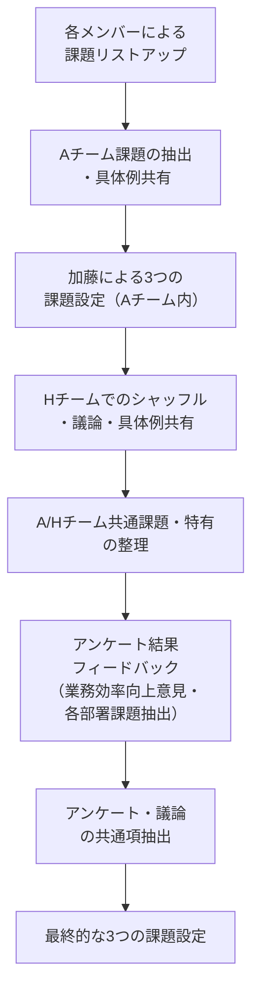

# Smart R&D 新規テーマ創出：加藤課題設定レポート（最終版）

---

## 【図解】3つの課題決定までの流れ

---

## 1. これまでの流れ

### Aチーム課題の要点
- **データ・ノウハウの散在、質のバラツキ**
  - 例：「必要なデータがPEAS、BOX、NASなど複数箇所に保存されていて探すのに時間がかかる」
  - 例：「過去の装置トラブル対応履歴が各GrのExcelやメールにしか残っておらず、担当者が異動すると情報が消える」
- **技術伝承・教育不足、属人化**
  - 例：「アラーム発生時、知見者に個別に問い合わせるしかなく、同じ問い合わせが何度も発生」
  - 例：「教育コンテンツや履歴の未整備、若手のローテーション時に引継ぎ工数が膨大」
- **システム・ツールの使い勝手や統合**
  - 例：「複数ツールの乱立、どれが便利か分からない、情報アクセスが非効率」
  - 例：「自動測長やレシピ作成ツールなどが多様化し、使いこなせていない」
- **生成AI等の新技術活用**
  - 例：「ChatGPT以外のAIが使えない、現場でのAI活用が進まない」
  - 例：「ノーコード/ローコードAIツールを現場で活用できず、非エンジニアの業務効率化が進まない」
- **業務プロセスの非効率・見直し**
  - 例：「無駄な会議や承認、資料作成が多い」
  - 例：「設計以外の業務が多く本来業務に集中できない」

### 加藤による3つの課題設定（Aチーム内）
1. **さまざまな生成AIの言語モデルを使用できるようにすべき**
   - 例：「ChatGPT-4o以外のAIモデルやSaaS型生成AIサービス（Google Gemini, Claude, Bolt等）が使えない」
2. **データが散在、かつ、質のバラツキが大きい**
   - 例：「前任者に聞かないと分からないノウハウ」「データのフォーマットがバラバラ」
3. **技術伝承、教育がされないため、アラーム発生時の初動対応ができない**
   - 例：「知見者が属人化しやすく、同じ問い合わせが何度も発生」「対応履歴が共有されていない」

### Hチームでのシャッフル・議論

#### Hチーム課題の要点
- **データ・ノウハウの散在、質のバラツキ**
  - 例：「実験データやパーツ管理が複数システムやExcelに分散」
- **技術伝承・教育不足、属人化**
  - 例：「若手ローテーション時の引継ぎ工数が多い」「知見・技術の伝承不足」
- **システム・ツールの使い勝手や統合**
  - 例：「自動測長やレシピ作成ツールなどが多様化し、どれが便利か分からない」
- **生成AI等の新技術活用**
  - 例：「ChatGPT以外のAIが使えない」「ノーコード/ローコードAIツールを現場で活用できず、非エンジニアの業務効率化が進まない」
- **システム自動化・API化**
  - 例：「装置データが自動で取得できず、手作業や外部RPAツールで対応している」
- **現場環境・設備の最適化**
  - 例：「計測器（SEM等）が不足し、予約が埋まり業務遅滞」
- **MASTER BOMやパーツ管理のシステム化**
  - 例：「ExcelでMASTER BOMを管理しているため、編集競合や事故が発生しやすい」
- **情報の可視化・利用状況の把握**
  - 例：「どのチームがどんな目的で社内機を使っているか分かりにくい」
- **パーツ開発・部品の内製化・共通化**
  - 例：「改造や不具合時の対応を早くしたい、内製化で発注までの手間や納期短縮を目指す」「内製化によりパーツレビューの頻度が上がり図面の完成度が上がる」

#### 具体例
- 「装置のデータが自動で取得できず、手作業でダウンロードしている」
- 「ExcelでMASTER BOMを管理しているため、誰かが編集していると編集できない・事故が発生」
- 「計測器が不足し、予約が埋まり現場がギスギスしている」

### A/Hチーム共通課題
- **データ・ノウハウの散在・質のバラツキ**
  - 例：「必要なデータがすぐに入手できない」「データが複数システムやExcelに分散」
- **技術伝承・教育不足・属人化**
  - 例：「知見者に都度問い合わせ、同じ問い合わせが繰り返される」「教育コンテンツや履歴の未整備」
- **システム・ツールの使い勝手や統合**
  - 例：「複数ツールの乱立、どれが便利か分からない」
- **生成AI等の新技術活用**
  - 例：「現場でのAI活用が進まない」「ノーコード/ローコードAIツールが使えない」
- **業務プロセスの非効率・見直し**
  - 例：「無駄な会議や承認が多い」「本業以外の業務が多い」

### A/Hチーム特有課題
- **Aチーム特有**
  - 設計・開発プロセスの負担、組織運営
    - 例：「設計者の負担増大、進捗管理や顧客対応の工数増」
  - 情報管理のサイロ化・意思決定の遅延
    - 例：「各部門が個別に情報を管理しているため、データの断片化が発生」
  - 他業界との情報交換・技術交流
    - 例：「他業界の開発プロセスを知らない人が多い」
- **Hチーム特有**
  - システム自動化・API化
    - 例：「社内システムのAPIがなく、データ取得の自動化が困難」
  - 現場環境・設備の最適化
    - 例：「計測器が不足し、予約が埋まり業務遅滞」
  - MASTER BOMやパーツ管理のシステム化
    - 例：「ExcelでMASTER BOMを管理しているため、編集競合や事故が発生」
  - 情報の可視化・利用状況の把握
    - 例：「どの機能が使われているか分からず、せっかく開発した機能が使われていない」

---

## 2. アンケート結果（業務効率向上意見・各部署からの課題抽出）のフィードバック

### アンケート結果サマリ

- **業務効率向上意見アンケート**では、「システム・ツールの統一・自動化・IT化」が最も多く挙げられ、次いで「マニュアル・手順書・ルールの整備」「情報共有・ナレッジの蓄積」「教育・サポート体制の強化」などが続きました。現場ではExcelやマクロによる手作業の多さ、複数システムの乱立、業務フローの煩雑さが大きな課題となっています。

- **各部署からの課題抽出アンケート**でも、「データ管理・活用」「ツール・システムの使い勝手・自動化」が最も多く、情報共有・連携や技術伝承・人材育成も多く挙げられました。データの散在やExcel手入力の非効率、既存ツールの使いづらさ、システム化・自動化の必要性が現場の共通課題です。

---

### 2.1 業務効率向上意見アンケートの集計結果

- **システム・ツールの統一・自動化・IT化**
  - 例：「Excelやマクロによる業務の自動化」「Webサービスや専用システムの導入」「複数システム・ツールの統合」
- **マニュアル・手順書・ルールの整備と見える化**
  - 例：「明確でシンプルな手順書の作成」「属人化の排除」「マニュアルやノウハウの一元管理」
- **情報共有・ナレッジの蓄積と活用**
  - 例：「部署横断的な情報共有」「ナレッジベースの構築」「過去資料や設計情報の素早い把握」
- **教育・サポート体制の強化**
  - 例：「プログラム学習支援」「データ解析ツール作成のサポート」「ITツールやAI活用の教育」
- **組織・業務分担の最適化**
  - 例：「適材適所の業務分担」「専門部署の設置」「横串体制の強化」
- **意思決定・業務フローの明確化**
  - 例：「上司による優先順位付けや意思決定の迅速化」「不要な業務やルールの見直し」

**最も多かった項目:**  
「システム・ツールの統一・自動化・IT化」に関する要望が最も多く挙げられました。  
特に「Excelやマクロによる業務の自動化」「Webサービスや専用システムの導入」「複数システムの統合」など、現状の煩雑な業務フローや手作業を減らし、効率化・標準化を図りたいという声が多数ありました。

---

### 2.2 各部署からの課題抽出アンケートの集計結果

- **データ管理・活用**
  - 例：「データが散在しており、どこに何があるか分からない（CPP）」「Excel手入力で非効率（TSMD）」「データ一元管理ができていない（SDD2, QA）**
- **ツール・システムの使い勝手・自動化**
  - 例：「既存ツールが使い辛い（TSMD, QA）」「ExcelやPowerPointでの管理が非効率（ADD, DE3, SDD1）」「システム化・自動化の必要性（AFD, DE3）**
- **情報共有・連携**
  - 例：「部門間での情報共有ができていない（PDC, APLA）」「設計部門との連携が薄い（5i PRO）」「情報共有の仕組みが不十分（APRO）**
- **人材・技術伝承・育成**
  - 例：「技術伝承が進んでいない（ADD, DE2, DE3）」「人材育成が課題（APLA, SFT）」「エンジニアの能力がパラメータ化されていない（SDD1）**
- **コスト・予算管理**
  - 例：「コストダウンの必要性（CPP）」「予算管理の工数が大きい（DE3, DPM）」「コストテーブルの整備が必要（DE1）**
- **セキュリティ・情報統制**
  - 例：「情報セキュリティの厳格化（CED, MFG3）」「顧客データの取得が困難（SDD1, DE2）**

**最も多かった項目:**  
「データ管理・活用」および「ツール・システムの使い勝手・自動化」に関する課題が最も多く挙げられました。  
多くの部署で「データが散在している」「Excelや既存ツールでの管理が非効率」「システム化・自動化が必要」といった声が目立ちます。

---

## 3. アンケート結果とA/Hの議論結果の共通項は何か？

- **データ・ノウハウの一元管理・標準化**
  - 散在・分断されたデータやノウハウを全社横断で一元管理・標準化する必要性
- **システム・ツールの統一・自動化**
  - Excelやマクロ、複数ツールの乱立から脱却し、業務フローの自動化・標準化・効率化
- **技術伝承・教育・ナレッジ共有の仕組み化**
  - 属人化排除、教育・マニュアル・ナレッジの整備と共有、誰でも同じ成果が出せる仕組み

---

## 4. 最終的な課題設定（アンケート結果とA/Hの議論結果の共通項を元に設定）

1. **データ・ノウハウの一元管理と質の標準化**
   - 例：「Excelや個人管理からの脱却」「BKMやナレッジの統合DB化」「検索性・アクセス性の向上」
2. **システム・ツールの統一・自動化（生成AI等の新技術活用を含む）**
   - 例：「Excel/マクロからWeb・専用システムへの移行」「API化」「AI活用による自動化」「ツールの一本化」
3. **技術伝承・教育・ナレッジ共有の仕組み化**
   - 例：「マニュアル・手順書の一元管理」「ナレッジベース構築」「教育コンテンツ整備」「OJT/研修の仕組み化」

---

この3つの課題は、A/Hチームの議論とアンケート結果の両方で最も多く挙げられたものであり、現場の困りごと・全体最適の観点からも最重要と判断します。
